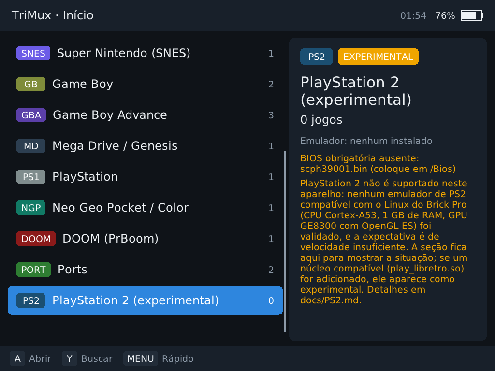
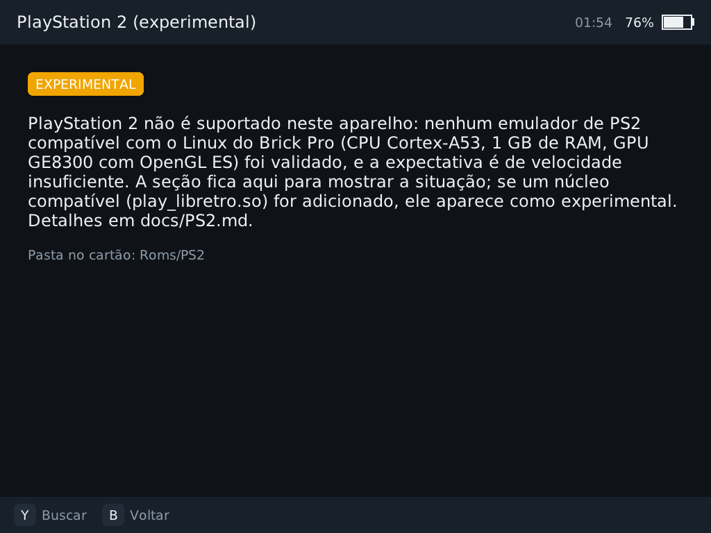

# PlayStation 2 no TrimUI Brick Pro

**Situação: não suportado. Nenhum emulador de PS2 está incluído.** A seção
**PlayStation 2 (experimental)** fica sempre visível no menu inicial, com o selo
EXPERIMENTAL e o texto abaixo resumido; abri-la mostra a explicação completa e a
pasta (`Roms/PS2`) onde jogos seriam reconhecidos.

## Requisitos e o que o aparelho oferece

| Requisito | Brick Pro (firmware v1.1.1) |
|---|---|
| CPU | 4× Cortex-A53 até 1,8 GHz (núcleo "in-order", sem execução fora de ordem) |
| RAM | 1 GB no total, compartilhado com GPU e sistema (o PS2 tem 32 MB + 4 MB de VRAM, mas emuladores com JIT e cache de texturas usam várias centenas de MB) |
| GPU / API | PowerVR GE8300, OpenGL ES 3.2 (DDK 1.19); biblioteca Vulkan presente mas sem ICD configurado |
| Sistema | Linux 4.9, glibc 2.33, aarch64 |

## Candidatos avaliados

| Emulador | Roda em Linux aarch64? | Por que não foi incluído |
|---|---|---|
| PCSX2 | Projeto oficial focado em x86-64; renderizadores exigem OpenGL 4.6 / Vulkan / D3D. | Não há build para Linux aarch64 com GLES; a API exigida não existe neste driver. |
| AetherSX2 / NetherSX2 | Somente Android, código fechado. | Não é Linux; empacotar um APK como se fosse compatível seria enganoso (proibido pelo escopo). |
| Play! (libretro `play_libretro`) | Sim, código aberto, usa OpenGL ES 3. | Não validado no aparelho. Mesmo em SoCs Android muito mais rápidos o desempenho é baixo para jogos 3D; com A53 a 1,8 GHz e 1 GB a expectativa é de velocidade bem abaixo de 100 % na maioria dos jogos. Compilar e distribuir sem medições seria anunciar suporte nominal. |

## Integração modular deixada pronta

* `systems.ini` tem a plataforma `PS2` (`experimental = 1`, pastas `PS2`/`ps2`,
  extensões `iso, chd, cso, cue, elf`, BIOS obrigatória `scph39001.bin`).
* `emulators.ini` tem a entrada `play` (`play_libretro.so`, perfil
  "Desempenho seguro", marcada experimental).
* Se alguém colocar um `play_libretro.so` compatível (aarch64, glibc ≤ 2.33)
  em `TriMux/retroarch/cores/`, o TriMux passa a oferecê-lo **com aviso de
  recurso experimental** antes de cada execução. Os limites de 1,8 GHz e a
  proteção térmica continuam valendo.

## Como testar, se você quiser medir

1. Compile o Play! para aarch64 no contêiner do projeto (glibc 2.31) e confirme
   com `scripts/check_abi.py` e `scripts/smoke_qemu.sh`.
2. Use jogos/homebrew **legais** e a BIOS do seu próprio console.
3. Registre para cada jogo: versão do firmware/TriMux, perfil, resolução
   interna, duração (≥ 20 min), FPS médio/mínimo, temperatura inicial/final,
   travamentos (modelo em [DESEMPENHO.md](DESEMPENHO.md)).
4. Só considere "jogável" um jogo que mantenha velocidade plena por toda a
   sessão sem acionar a proteção térmica.
