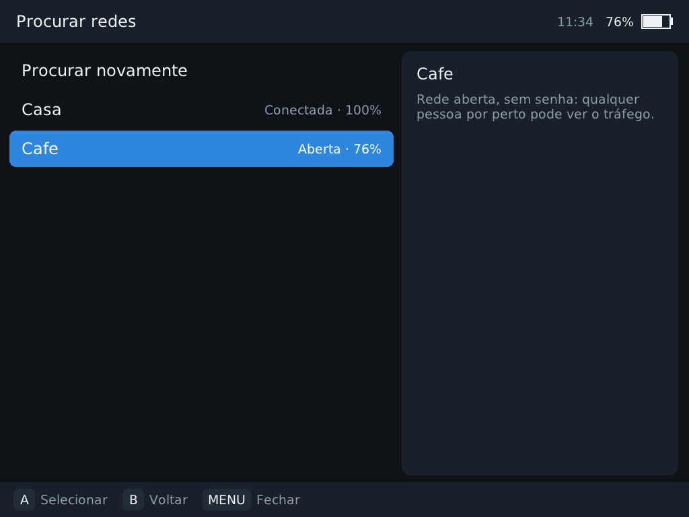

# Rede: Wi-Fi, Bluetooth, RetroAchievements, FTP e SSH

*Configurações › Rede e conexões.* Tudo aqui usa as ferramentas que já vêm no
firmware oficial, com os mesmos comandos e arquivos que o sistema oficial usa.
Nada é instalado na memória interna.

> **Estado: testado só em ambiente simulado.** A lógica, os comandos enviados
> às ferramentas do firmware e a interface foram testados com ferramentas
> falsas no computador (veja [TESTES.md](TESTES.md)). Conectar de verdade,
> velocidade do FTP, reconexão Bluetooth e login no RetroAchievements
> dependem de teste no Brick Pro (H29–H34).


## Wi-Fi

| Item | O que faz |
|---|---|
| Wi-Fi | Liga/desliga. Mesma sequência do firmware (`ifconfig wlan0`, `wpa_supplicant` com os argumentos de `/etc/init.d/wpa_supplicant`, `udhcpc`). |
| Situação | Rede e IP atuais (`wpa_cli status`), atualiza sozinha. |
| Procurar redes | Lista as redes próximas, da mais forte para a mais fraca. A conecta: rede salva ou aberta conecta direto, rede com senha abre o teclado. |
| Redes salvas | Lista e permite esquecer redes. |

* **As redes são as mesmas do sistema oficial.** O TriMux usa o mesmo
  `wpa_supplicant`, o mesmo socket (`/etc/wifi/sockets`) e a mesma lista
  (`/etc/wifi/wpa_supplicant.conf`). Uma rede salva em um sistema funciona no
  outro; esquecer em um apaga nos dois.
* Suportado: redes abertas e **WPA/WPA2 com senha**. Não suportado: redes
  empresariais (EAP), WEP e redes só WPA3 (aparecem como "Não suportada").
* O nome da rede é enviado em hexadecimal, então acentos, espaços e aspas no
  nome funcionam. A senha precisa ter de 8 a 63 caracteres (regra do WPA).
* A senha digitada não vai para o log do TriMux nem para o `trimux.ini`; quem
  a guarda é o `wpa_supplicant`, no mesmo arquivo do sistema oficial.
* Ao ligar, o Wi-Fi segue o que o firmware decidir até você mudar no TriMux.
  Depois disso, o TriMux reaplica a sua escolha (ligado ou desligado) a cada
  inicialização (`[network] wifi` no `trimux.ini`).

 

**Teclado de texto:** R1 (ou SELECT, ou a tecla da tela) alterna entre
minúsculas, MAIÚSCULAS e símbolos. X apaga, Y insere espaço, START confirma,
B apaga ou volta.

## Bluetooth

"Bluetooth da TrimUI" mantém ativo o `trimui_btmanager`, o serviço Bluetooth
do próprio firmware, iniciado do mesmo jeito que o `runtrimui.sh` oficial faz.
Ele vem desligado no TriMux para economizar memória.

* **Pareie aparelhos no sistema oficial.** O protocolo interno desse serviço
  não é documentado, então o TriMux não tenta parear nem listar aparelhos.
* A ideia é que controles e fones já pareados reconectem com o serviço ativo.
  Isso **não foi verificado** no aparelho.
* Áudio Bluetooth nos jogos **não é garantido**: no próprio firmware v1.1.1 a
  linha que liga o `bluealsa` está comentada no script de boot.

## RetroAchievements

Conquistas para jogos clássicos (retroachievements.org). O RetroArch do TriMux
agora é compilado com suporte a rede, HTTPS (mbedTLS embutido) e
RetroAchievements. A atualização online de núcleos e arquivos continua
desligada, assim como a descoberta de salas de netplay.

1. Crie uma conta gratuita em retroachievements.org (no computador ou celular).
2. *Rede e conexões › RetroAchievements*: ative, digite usuário e senha.
3. Abra um jogo com o Wi-Fi conectado. O RetroArch entra na conta e mostra as
   conquistas. Sem Wi-Fi, o jogo abre normalmente.

* **A senha fica salva no cartão sem criptografia** (`TriMuxData/config/trimux.ini`,
  seção `[cheevos]`). Use uma senha que você não usa em outros lugares. A cada
  jogo ela é passada ao RetroArch só pelo arquivo temporário em RAM
  (`/tmp/trimux/ra-append.cfg`) e nunca vai para o log.
* Aspas (`"`) não são aceitas no usuário nem na senha (limite do formato de
  configuração do RetroArch).
* Modo hardcore: as conquistas valem mais, mas o RetroArch bloqueia
  salvar/carregar estado, avanço rápido e trapaças.
* Nem todo núcleo ou jogo tem conquistas; a lista está no site.

## Transferir arquivos (FTP)

Copie jogos, BIOS e saves pelo computador, na mesma rede Wi-Fi.

1. *Rede e conexões › Transferir arquivos (FTP)*.
2. A janela mostra o endereço, por exemplo `ftp://192.168.0.23`.
3. No computador: Windows Explorer (digite o endereço na barra), FileZilla ou
   o Finder do macOS (Ir › Conectar ao servidor). Usuário `anonymous`, sem senha.
4. Feche a janela (A ou B) quando terminar: **o servidor para na hora** e a
   biblioteca é reindexada para os jogos novos aparecerem.

* Servidor: `tcpsvd` + `ftpd` do BusyBox do firmware, preso à pasta do cartão
  (`/mnt/SDCARD`, sem acesso ao resto do sistema), só no IP do Wi-Fi, no máximo
  4 conexões, desconexão após 10 minutos parado.
* **Sem senha:** o `ftpd` do firmware (BusyBox 1.27) só aceita acesso anônimo.
  Por isso ele só roda enquanto a janela está aberta, e também para se o menu
  fechar. Use em redes de confiança (sua casa), nunca em Wi-Fi público.

## SSH e SFTP do firmware

O firmware oficial tem um servidor OpenSSH (usuário `root`). O sistema
oficial o desliga quando a opção "Enable SSH" está desligada; como o TriMux
substitui o menu oficial, ele faz o mesmo: **SSH desligado por padrão** a cada
inicialização.

* Ligar pede confirmação, porque dá acesso total ao aparelho a quem estiver na
  mesma rede e souber a senha do firmware.
* Com o SSH ligado, programas como WinSCP ou FileZilla (protocolo SFTP)
  também servem para copiar arquivos, com senha.
* O TriMux não muda a senha do firmware nem a documenta.

## Configurações guardadas (`TriMuxData/config/trimux.ini`)

```ini
[network]
wifi = on          ; on | off | (vazio: deixa como o firmware ligou)
bluetooth = 0      ; 1 = mantém o trimui_btmanager ativo
ssh = 0            ; 1 = deixa o sshd do firmware ligado

[cheevos]
enable = 0
user =
password =         ; sem criptografia
hardcore = 0
```

## Diagnóstico

`trimuxctl net status` (por SSH ou num script) mostra se Wi-Fi, Bluetooth e
SSH estão disponíveis e ligados, com rede e IP. O log
`TriMuxData/logs/trimux.log` registra cada ação de rede, sem senhas.
